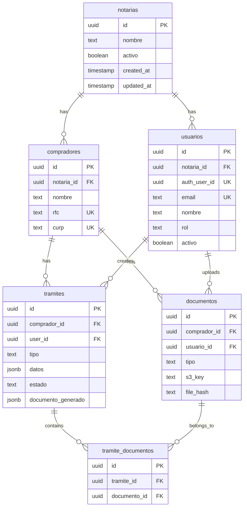

# Backend & Data Audit Report - Notary Application

**Date:** January 21, 2026  
**Scope:** API design, database schema, services layer, AWS integrations, data patterns  
**Skills Applied:** `api-patterns`, `database-design`, `aws-serverless`

---

## Executive Summary

This audit evaluates the Notary application's backend architecture, including Next.js API routes, Supabase database design, S3 file storage, and AWS Textract/OpenAI integrations.

| Category | Status | Critical Issues | Warnings |
|----------|--------|-----------------|----------|
| API Design | 🟡 Fair | Missing auth on PUT/DELETE | No rate limiting |
| Response Format | 🟡 Fair | Inconsistent error shapes | No pagination |
| Database Schema | 🟢 Good | Proper normalization | Some N+1 patterns |
| Supabase Integration | 🟢 Good | Service role separation | Missing RLS details |
| AWS Integration | 🟢 Good | Proper error handling | Client init in module scope |
| Type Safety | 🔴 Needs Work | `any` in services | Type mismatches |

---

## 🔴 Critical Issues

### 1. Missing Authentication on Critical Endpoints

Several API routes don't validate authentication before performing sensitive operations.

#### Unprotected Operations

| File | Method | Issue |
|------|--------|-------|
| [tramites/route.ts](file:///Users/octaviopalacios/Documents/MIND/Notary/app/api/expedientes/tramites/route.ts#L109) | PUT | No `getCurrentUserFromRequest()` |
| [tramites/route.ts](file:///Users/octaviopalacios/Documents/MIND/Notary/app/api/expedientes/tramites/route.ts#L149) | DELETE | No `getCurrentUserFromRequest()` |
| [compradores/route.ts](file:///Users/octaviopalacios/Documents/MIND/Notary/app/api/expedientes/compradores/route.ts#L175) | PUT | No `getCurrentUserFromRequest()` |

#### Current vs. Recommended

```typescript
// ❌ Current: PUT without auth check (line 109)
export async function PUT(req: Request) {
  try {
    const { searchParams } = new URL(req.url)
    const id = searchParams.get('id')
    // ... directly updates without auth check
    const tramite = await TramiteService.updateTramite(id, updateData)
  }
}

// ✅ Recommended: Add auth check
export async function PUT(req: Request) {
  try {
    const currentUser = await getCurrentUserFromRequest(req)
    if (!currentUser?.activo) {
      return NextResponse.json(
        { error: 'unauthorized', message: 'No autenticado' },
        { status: 401 }
      )
    }
    
    // Verify ownership or admin access
    const tramite = await TramiteService.findTramiteById(id)
    if (tramite.user_id !== currentUser.id && currentUser.rol !== 'superadmin') {
      return NextResponse.json(
        { error: 'forbidden', message: 'No tienes permiso para editar este trámite' },
        { status: 403 }
      )
    }
    // ...
  }
}
```

---

### 2. Type Safety Issues in Services

The service layer uses `any` types extensively, defeating TypeScript benefits.

#### Examples

| File | Line | Issue |
|------|------|-------|
| [tramite-service.ts](file:///Users/octaviopalacios/Documents/MIND/Notary/lib/services/tramite-service.ts#L156) | 156 | `const updateData: any = {}` |
| [documento-service.ts](file:///Users/octaviopalacios/Documents/MIND/Notary/lib/services/documento-service.ts#L170) | 170 | `(request as any).usuarioId` |
| [documento-service.ts](file:///Users/octaviopalacios/Documents/MIND/Notary/lib/services/documento-service.ts#L302) | 302 | Cast to `any[]` for filtering |

```typescript
// ❌ Current: Type unsafe
static async updateTramite(
  id: string,
  updates: {
    comprador_id?: string | null
    datos?: any  // 👈 Should be typed
    estado?: EstadoTramite
    documento_generado?: any  // 👈 Should be typed
    notas?: string
  }
): Promise<Tramite> {
  const updateData: any = {}  // 👈 any type

// ✅ Recommended: Proper typing
interface TramiteUpdateData {
  comprador_id?: string | null
  datos?: PreavisoDatos | PlanoArquitectonicoDatos
  estado?: EstadoTramite
  documento_generado?: DocumentoGenerado | null
  notas?: string | null
}

static async updateTramite(
  id: string,
  updates: TramiteUpdateData
): Promise<Tramite> {
  const updateData: Partial<TramiteUpdateData> = {}
```

---

### 3. No API Rate Limiting

No rate limiting is implemented on any endpoint, making the API vulnerable to abuse.

#### Critical Endpoints Without Rate Limiting

| Endpoint | Risk |
|----------|------|
| `/api/ai/preaviso-chat` | OpenAI API costs |
| `/api/ai/preaviso-process-document` | OpenAI Vision costs |
| `/api/ocr/extract` | AWS Textract costs |
| `/api/expedientes/documentos/upload` | S3 storage costs |

#### Recommendation: Add Rate Limiting

```typescript
// lib/rate-limit.ts
import { Ratelimit } from '@upstash/ratelimit'
import { Redis } from '@upstash/redis'

const ratelimit = new Ratelimit({
  redis: Redis.fromEnv(),
  limiter: Ratelimit.slidingWindow(10, '60 s'), // 10 requests per minute
  analytics: true,
})

// In API routes
export async function POST(req: Request) {
  const ip = req.headers.get('x-forwarded-for') ?? 'anonymous'
  const { success, limit, remaining, reset } = await ratelimit.limit(ip)
  
  if (!success) {
    return NextResponse.json(
      { error: 'rate_limit_exceeded', message: 'Too many requests' },
      { 
        status: 429,
        headers: {
          'X-RateLimit-Limit': limit.toString(),
          'X-RateLimit-Remaining': remaining.toString(),
          'X-RateLimit-Reset': reset.toString(),
        }
      }
    )
  }
  // ...
}
```

---

## 🟡 Warnings

### 4. Inconsistent Error Response Format

Error responses have different structures across endpoints.

#### Current Inconsistencies

```typescript
// Pattern A: error + message
{ error: 'not_found', message: 'Trámite no encontrado' }

// Pattern B: error object
{ error: { code: 'invalid_file', message: '...' } }

// Pattern C: message only
{ message: 'Error interno del servidor' }
```

#### Recommendation: Standardize Error Format

```typescript
// lib/api-response.ts
interface ApiError {
  code: string
  message: string
  details?: Record<string, unknown>
  timestamp: string
  requestId?: string
}

interface ApiResponse<T = unknown> {
  success: boolean
  data?: T
  error?: ApiError
}

export function errorResponse(
  code: string,
  message: string,
  status: number,
  details?: Record<string, unknown>
): NextResponse {
  return NextResponse.json(
    {
      success: false,
      error: {
        code,
        message,
        details,
        timestamp: new Date().toISOString(),
      }
    },
    { status }
  )
}

// Usage
return errorResponse('NOT_FOUND', 'Trámite no encontrado', 404)
return errorResponse('VALIDATION_ERROR', 'Campo requerido', 400, { field: 'nombre' })
```

---

### 5. N+1 Query Patterns

The code has potential N+1 query issues when fetching related data.

#### Example: [tramites/route.ts](file:///Users/octaviopalacios/Documents/MIND/Notary/app/api/expedientes/tramites/route.ts#L44)

```typescript
// ❌ Current: N+1 queries
const tramitesConDocumentos = await Promise.all(
  tramites.map(async (tramite) => {
    const documentos = await TramiteDocumentoService.listDocumentosPorTramite(tramite.id)
    // 1 query per tramite = N+1
    return { ...tramite, documentos }
  })
)

// ✅ Recommended: Single join query in service
static async findTramitesWithDocumentos(compradorId: string): Promise<TramiteConDocumentos[]> {
  const supabase = createServerClient()
  
  const { data, error } = await supabase
    .from('tramites')
    .select(`
      *,
      tramite_documentos (
        documento:documentos (*)
      )
    `)
    .eq('comprador_id', compradorId)
    .order('created_at', { ascending: false })
  
  return data.map(t => ({
    ...t,
    documentos: t.tramite_documentos.map(td => td.documento)
  }))
}
```

---

### 6. Missing Input Validation (Zod)

API routes rely on runtime checks instead of schema validation.

#### Current Pattern

```typescript
// ❌ Current: Manual validation
export async function POST(req: Request) {
  const body = await req.json()
  
  if (!body.nombre || !body.curp) {
    return NextResponse.json(
      { error: 'bad_request', message: 'nombre y curp son requeridos' },
      { status: 400 }
    )
  }
}
```

#### Recommendation: Zod Validation

```typescript
// ✅ With Zod
import { z } from 'zod'

const CreateCompradorSchema = z.object({
  nombre: z.string().min(1, 'Nombre es requerido'),
  curp: z.string().length(18, 'CURP debe tener 18 caracteres'),
  rfc: z.string().optional(),
  direccion: z.string().optional(),
  telefono: z.string().optional(),
  email: z.string().email('Email inválido').optional(),
})

export async function POST(req: Request) {
  const body = await req.json()
  const result = CreateCompradorSchema.safeParse(body)
  
  if (!result.success) {
    return NextResponse.json(
      { 
        error: 'validation_error', 
        message: 'Datos inválidos',
        details: result.error.flatten()
      },
      { status: 400 }
    )
  }
  
  const comprador = await CompradorService.createComprador(result.data)
}
```

---

### 7. Missing Pagination on List Endpoints

List endpoints return all records without pagination.

#### Current Issues

| Endpoint | Issue |
|----------|-------|
| `GET /api/expedientes/tramites?compradorId=x` | Returns all tramites |
| `GET /api/expedientes/compradores?search=x` | Limited to 20, not paginated |

#### Recommendation: Add Pagination

```typescript
// lib/pagination.ts
interface PaginationParams {
  page: number
  limit: number
  offset: number
}

interface PaginatedResponse<T> {
  data: T[]
  pagination: {
    page: number
    limit: number
    total: number
    totalPages: number
    hasMore: boolean
  }
}

// In service
static async findTramitesPaginated(
  compradorId: string,
  page: number = 1,
  limit: number = 20
): Promise<PaginatedResponse<Tramite>> {
  const offset = (page - 1) * limit
  
  const [{ count }, { data }] = await Promise.all([
    supabase.from('tramites').select('*', { count: 'exact', head: true }),
    supabase.from('tramites')
      .select('*')
      .eq('comprador_id', compradorId)
      .range(offset, offset + limit - 1)
      .order('created_at', { ascending: false })
  ])
  
  return {
    data,
    pagination: {
      page,
      limit,
      total: count ?? 0,
      totalPages: Math.ceil((count ?? 0) / limit),
      hasMore: offset + limit < (count ?? 0)
    }
  }
}
```

---

### 8. AWS Client Initialization in Module Scope

AWS clients are initialized at module import time, which can cause issues.

#### Current Pattern

```typescript
// ❌ Current: Module-level initialization (s3-service.ts line 4, ocr/extract/route.ts line 7)
const s3Client = new S3Client({
  region: process.env.AWS_REGION || 'us-east-1',
  credentials: process.env.AWS_ACCESS_KEY_ID && process.env.AWS_SECRET_ACCESS_KEY
    ? { accessKeyId: process.env.AWS_ACCESS_KEY_ID!, secretAccessKey: process.env.AWS_SECRET_ACCESS_KEY! }
    : undefined,
})

// This runs at import time, even if the module is never used
```

#### Recommendation: Lazy Initialization

```typescript
// ✅ Lazy singleton pattern
let _s3Client: S3Client | null = null

function getS3Client(): S3Client {
  if (!_s3Client) {
    _s3Client = new S3Client({
      region: process.env.AWS_REGION || 'us-east-1',
      credentials: {
        accessKeyId: process.env.AWS_ACCESS_KEY_ID!,
        secretAccessKey: process.env.AWS_SECRET_ACCESS_KEY!,
      },
    })
  }
  return _s3Client
}
```

---

## 🟢 Good Practices Found

### 9. Database Schema Design

The database schema follows good normalization practices.

#### Positive Observations

| Practice | Location | Notes |
|----------|----------|-------|
| **UUID Primary Keys** | All tables | Good for distributed systems |
| **Proper Indexes** | [001_create_expedientes_tables.sql](file:///Users/octaviopalacios/Documents/MIND/Notary/supabase/migrations/001_create_expedientes_tables.sql#L22-L25) | RFC, CURP, nombre indexed |
| **GIN Index for JSONB** | Line 64 | `idx_tramites_datos_gin` for JSON search |
| **Updated_at Triggers** | Lines 27-31 | Automatic timestamp management |
| **Many-to-Many Table** | `tramite_documentos` | Clean document sharing |
| **Unique Constraints** | `UNIQUE(tramite_id, documento_id)` | Prevents duplicate associations |

```sql
-- ✅ Good: Proper indexes
CREATE INDEX IF NOT EXISTS idx_compradores_rfc ON compradores(rfc);
CREATE INDEX IF NOT EXISTS idx_compradores_curp ON compradores(curp);
CREATE INDEX IF NOT EXISTS idx_tramites_datos_gin ON tramites USING GIN (datos);
```

---

### 10. Multi-Tenant Preparation

The schema is prepared for multi-tenancy with notaria_id.

```sql
-- ✅ Good: Multi-tenant ready (003_create_auth_tables.sql)
ALTER TABLE compradores 
ADD COLUMN IF NOT EXISTS notaria_id UUID REFERENCES notarias(id) ON DELETE CASCADE;

-- Constraint ensures abogados have notaria_id
CONSTRAINT usuarios_abogado_notaria CHECK (
  (rol = 'superadmin' AND notaria_id IS NULL) OR
  (rol = 'abogado' AND notaria_id IS NOT NULL)
)
```

---

### 11. Document Deduplication

The document service implements proper file deduplication using MD5 hashes.

```typescript
// ✅ Good: Hash-based deduplication (documento-service.ts)
private static async calculateFileHash(file: File | Buffer): Promise<string> {
  const arrayBuffer = file instanceof File ? await file.arrayBuffer() : file
  const buffer = Buffer.from(arrayBuffer)
  return createHash('md5').update(buffer).digest('hex')
}

// Check for existing document before upload
const existingDocumento = await this.findDocumentoByHash(request.compradorId || null, fileHash)
if (existingDocumento) {
  console.log(`Documento duplicado detectado, reutilizando: ${existingDocumento.id}`)
  return existingDocumento
}
```

---

### 12. S3 Key Structure

Well-organized S3 key structure for document storage.

```typescript
// ✅ Good: Organized S3 structure (s3-service.ts)
/**
 * expedientes/
 *   {compradorId}/
 *     tramites/
 *       {tramiteId}/
 *         {tipoTramite}/
 *           {tipoDocumento}/
 *             {año}/{mes}/
 *               {timestamp}-{fileName}
 */
static generateKey(
  compradorId: string, 
  tramiteId: string, 
  tipoTramite: string,
  tipoDocumento: string, 
  fileName: string
): string {
  // Temporal support for drafts
  if (compradorId.startsWith('temp-')) {
    return `expedientes/_temp/${tempId}/...`
  }
  return `expedientes/${compradorId}/tramites/${tramiteId}/...`
}
```

---

### 13. OpenAI Vision Integration

The document processing route has comprehensive validation.

```typescript
// ✅ Good: Thorough image validation (preaviso-process-document/route.ts)
// Validate file size
const maxSize = 20 * 1024 * 1024 // 20MB
if (arrayBuffer.byteLength > maxSize) {
  return NextResponse.json(
    { error: 'file_too_large', message: `...` },
    { status: 400 }
  )
}

// Validate magic bytes for image formats
const isValidImage = 
  // PNG: 89 50 4E 47
  (uint8Array[0] === 0x89 && uint8Array[1] === 0x50 && ...) ||
  // JPEG: FF D8 FF
  (uint8Array[0] === 0xFF && uint8Array[1] === 0xD8 && ...) ||
  // GIF, WEBP...
```

---

## Database Schema Diagram



---

## API Endpoint Summary

| Endpoint | Methods | Auth Required | Rate Limited | Paginated |
|----------|---------|---------------|--------------|-----------|
| `/api/auth/me` | GET | ✅ | ❌ | N/A |
| `/api/expedientes/compradores` | GET, POST, PUT | GET ✅, POST ✅, PUT ❌ | ❌ | ⚠️ limit=20 |
| `/api/expedientes/tramites` | GET, POST, PUT, DELETE | POST ✅, others ❌ | ❌ | ❌ |
| `/api/expedientes/documentos/upload` | POST | ❌ | ❌ | N/A |
| `/api/ai/preaviso-chat` | POST | ❌ | ❌ | N/A |
| `/api/ai/preaviso-process-document` | POST | ❌ | ❌ | N/A |
| `/api/ocr/extract` | POST | ❌ | ❌ | N/A |

---

## Recommendations Summary

### Immediate Actions (P0 - This Week)

1. **Add auth checks** to PUT/DELETE endpoints
2. **Add rate limiting** to AI/OCR endpoints (cost protection)
3. **Add input validation** with Zod to all POST/PUT endpoints

### Short-Term (P1 - Next 2 Weeks)

4. **Standardize error responses** across all endpoints
5. **Fix N+1 queries** with Supabase joins
6. **Add pagination** to list endpoints
7. **Replace `any` types** in services with proper interfaces

### Medium-Term (P2 - Next Month)

8. **Add API documentation** with OpenAPI/Swagger
9. **Implement request logging** with structured logs
10. **Add health check endpoint** for monitoring

### Long-Term (P3 - Ongoing)

11. **Set up monitoring** for API errors and latency
12. **Implement caching** for frequently accessed data
13. **Add database query optimization** based on usage patterns

---

## Appendix: Missing RLS Policies

The migrations don't explicitly define Row Level Security (RLS) policies. Supabase RLS should be enabled on all tables.

```sql
-- Recommended RLS policies
ALTER TABLE compradores ENABLE ROW LEVEL SECURITY;

CREATE POLICY "Users can view compradores in their notaria" ON compradores
  FOR SELECT USING (
    notaria_id = (SELECT notaria_id FROM usuarios WHERE auth_user_id = auth.uid())
    OR EXISTS (SELECT 1 FROM usuarios WHERE auth_user_id = auth.uid() AND rol = 'superadmin')
  );

CREATE POLICY "Users can insert compradores to their notaria" ON compradores
  FOR INSERT WITH CHECK (
    notaria_id = (SELECT notaria_id FROM usuarios WHERE auth_user_id = auth.uid())
  );

-- Similar policies for tramites, documentos, etc.
```

---

*This audit was generated following the `api-patterns`, `database-design`, and `aws-serverless` skill guidelines.*
