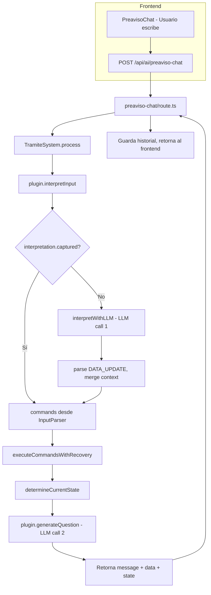
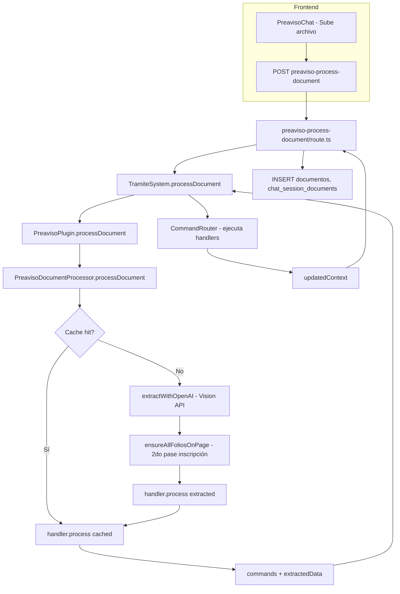

# Flujo Actual del Chat y Procesamiento de Documentos

**Referencia:** Documento para el plan de refactor multi-agente. Describe el flujo **actual** (antes del refactor).

---

## 1. Flujo de Chat (mensaje del usuario)

```
┌─────────────────────────────────────────────────────────────────────────────────┐
│ FRONTEND: PreavisoChat                                                           │
│ - Usuario escribe mensaje                                                        │
│ - POST /api/ai/preaviso-chat { messages, context, tramiteId }                    │
└─────────────────────────────────────────────────────────────────────────────────┘
                                        │
                                        ▼
┌─────────────────────────────────────────────────────────────────────────────────┐
│ API: preaviso-chat/route.ts                                                      │
│ - Extrae lastUserMessage, context, pluginId                                      │
│ - tramiteSystem.process(pluginId, lastUserMessage, context, messages.slice(-10)) │
└─────────────────────────────────────────────────────────────────────────────────┘
                                        │
                                        ▼
┌─────────────────────────────────────────────────────────────────────────────────┐
│ TramiteSystem.process()                                                          │
│ 1. plugin.interpretInput(userInput, context, lastAssistantMessage)               │
│    → InputParser (determinista) o needsLLM=true                                  │
└─────────────────────────────────────────────────────────────────────────────────┘
                                        │
                    ┌───────────────────┴───────────────────┐
                    │                                       │
                    ▼                                       ▼
         interpretation.captured                   !interpretation.captured
                    │                                       │
                    │                                       ▼
                    │                    ┌──────────────────────────────────────────┐
                    │                    │ TramiteSystem.interpretWithLLM()          │
                    │                    │ - Llama LLM con prompt inline             │
                    │                    │ - Modelo emite <DATA_UPDATE> con JSON     │
                    │                    │ - Parsea commands + updatedContext        │
                    │                    │ - Merge defensivo (preservar arrays)      │
                    │                    └──────────────────────────────────────────┘
                    │                                       │
                    └───────────────────┬───────────────────┘
                                        │
                                        ▼
┌─────────────────────────────────────────────────────────────────────────────────┐
│ TramiteSystem.process() (continúa)                                               │
│ 5. executeCommandsWithRecovery(commands) → CommandRouter → handlers              │
│ 6. stateMachine.determineCurrentState(plugin, updatedContext)                    │
│ 7. plugin.validate(updatedContext)                                               │
│ 8. plugin.generateQuestion(newState, updatedContext, conversationHistory)        │
└─────────────────────────────────────────────────────────────────────────────────┘
                                        │
                                        ▼
┌─────────────────────────────────────────────────────────────────────────────────┐
│ PreavisoPlugin.generateQuestion()                                                │
│ - Lógica determinista para casos especiales (folios, personas pendientes, etc.)  │
│ - PreavisoPrompts.generateSystemPrompts() → PROMPT 1+2+3+4 (grande, ~3–4k tokens)│
│ - PreavisoPrompts.generateUserPrompt()                                           │
│ - LLMService.call() → segunda llamada LLM por turno                              │
│ - Fallback: generateDeterministicQuestion() si LLM falla                         │
└─────────────────────────────────────────────────────────────────────────────────┘
                                        │
                                        ▼
┌─────────────────────────────────────────────────────────────────────────────────┐
│ TramiteSystem.process() retorna                                                  │
│ { message, data: updatedContext, state, commands, meta }                         │
└─────────────────────────────────────────────────────────────────────────────────┘
                                        │
                                        ▼
┌─────────────────────────────────────────────────────────────────────────────────┐
│ API preaviso-chat: guarda historial, ActivityLogService, retorna al frontend     │
└─────────────────────────────────────────────────────────────────────────────────┘
```

### Resumen: 2 llamadas LLM por turno de chat

1. **interpretWithLLM** (si no hay captura determinista): interpreta input → emite DATA_UPDATE.
2. **generateQuestion**: genera la siguiente pregunta/respuesta natural al usuario.

---

## 2. Flujo de Procesamiento de Documentos

```
┌─────────────────────────────────────────────────────────────────────────────────┐
│ FRONTEND: PreavisoChat                                                           │
│ - Usuario sube archivo (PDF, imagen)                                             │
│ - POST /api/ai/preaviso-process-document (formData: file, documentType, context) │
└─────────────────────────────────────────────────────────────────────────────────┘
                                        │
                                        ▼
┌─────────────────────────────────────────────────────────────────────────────────┐
│ API: preaviso-process-document/route.ts                                          │
│ - tramiteSystem.processDocument(pluginId, file, documentType, context)           │
└─────────────────────────────────────────────────────────────────────────────────┘
                                        │
                                        ▼
┌─────────────────────────────────────────────────────────────────────────────────┐
│ TramiteSystem.processDocument()                                                  │
│ - plugin.processDocument(file, documentType, context)                            │
│   → PreavisoPlugin delega en PreavisoDocumentProcessor                           │
└─────────────────────────────────────────────────────────────────────────────────┘
                                        │
                                        ▼
┌─────────────────────────────────────────────────────────────────────────────────┐
│ PreavisoDocumentProcessor.processDocument()                                      │
│ 0. Check cache (fileHash → DocumentoService.findExtractionData)                  │
│    Si hit → handler.process(cachedExtraction) → return { commands, extractedData }│
└─────────────────────────────────────────────────────────────────────────────────┘
                                        │ cache miss
                                        ▼
┌─────────────────────────────────────────────────────────────────────────────────┐
│ PreavisoDocumentProcessor.extractWithOpenAI(file, documentType)                  │
│ - getHandler(documentType) → inscripcion | identificacion | acta_matrimonio      │
│ - Vision API con prompt del handler                                              │
│ - 1er pase: extracción principal                                                 │
│ - 2do pase (solo inscripción): ensureAllFoliosOnPage()                           │
│ - ActivityLogService.logAIUsage (extract_document_data, extract_document_folios) │
└─────────────────────────────────────────────────────────────────────────────────┘
                                        │
                                        ▼
┌─────────────────────────────────────────────────────────────────────────────────┐
│ PreavisoDocumentProcessor (continúa)                                             │
│ - DocumentoService.saveExtractionData(fileHash, extracted) // cache              │
│ - handler.process(extracted, context) → commands                                 │
│ - return { commands, extractedData }                                             │
└─────────────────────────────────────────────────────────────────────────────────┘
                                        │
                                        ▼
┌─────────────────────────────────────────────────────────────────────────────────┐
│ TramiteSystem.processDocument() (continúa)                                       │
│ - filterCommandsByAllowedTools(commands)                                         │
│ - Ejecuta cada comando vía CommandRouter → handlers (folio, titular, buyer, etc.)│
│ - Merge profundo de updatedContext (preservar compradores, créditos, etc.)       │
│ - return { data, commands, extractedData }                                       │
└─────────────────────────────────────────────────────────────────────────────────┘
                                        │
                                        ▼
┌─────────────────────────────────────────────────────────────────────────────────┐
│ API preaviso-process-document (continúa)                                         │
│ - INSERT documentos (metadata: { extracted_data: result.extractedData })         │
│ - INSERT chat_session_documents (vincular documento con sesión)                  │
│ - ActivityLogService.logDocumentUpload                                           │
└─────────────────────────────────────────────────────────────────────────────────┘
```

### Resumen: flujo de documentos

- **PreavisoDocumentProcessor** orquesta: cache → Vision API (handlers por tipo) → commands.
- **TramiteSystem** ejecuta comandos y hace merge al contexto.
- **API route** guarda en `documentos` y `chat_session_documents`.

---

## 3. Componentes clave

| Componente | Archivo | Función |
|------------|---------|---------|
| TramiteSystem | `lib/tramites/base/tramite-system.ts` | Orquesta process() y processDocument(); interpretWithLLM; ejecuta comandos |
| PreavisoPlugin | `lib/tramites/plugins/preaviso/preaviso-plugin.ts` | interpretInput, generateQuestion, processDocument (delega) |
| PreavisoDocumentProcessor | `lib/tramites/plugins/preaviso/document-processor.ts` | extractWithOpenAI (Vision); handlers por tipo |
| InputParser | `lib/tramites/shared/input-parser.ts` | Captura determinista (respuestas cortas) |
| Handlers (documentos) | `document-processor/handlers/*.ts` | inscripcion-handler, identificacion-handler, acta-matrimonio-handler |
| Handlers (comandos) | `handlers/*.ts` | folio-selection-handler, titular-registral-handler, buyer-name-handler, etc. |
| PreavisoPrompts | `lib/tramites/plugins/preaviso/preaviso-prompts.ts` | generateSystemPrompts, generateUserPrompt (PROMPT 1+2+3+4) |
| LLMService | `lib/tramites/shared/services/llm-service.ts` | call(prompt, systemPrompts, ...) → OpenAI |

---

## 4. Diagrama Mermaid (flujo de chat)



---

## 5. Diagrama Mermaid (flujo de documentos)


