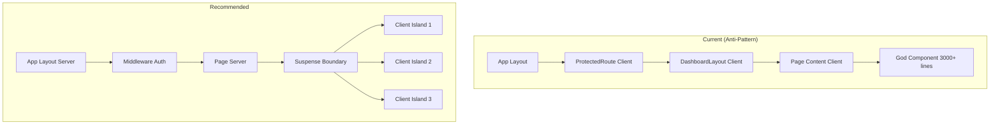

# Frontend Audit Report - Notary Application

**Date:** January 21, 2026  
**Scope:** Frontend architecture, React patterns, Next.js practices, Tailwind CSS usage  
**Skills Applied:** `nextjs-best-practices`, `react-best-practices`, `react-patterns`, `tailwind-patterns`, `nextjs-supabase-auth`

---

## Executive Summary

This audit evaluates the Notary application's frontend against modern React 19 and Next.js 16 best practices. The application uses the App Router, Supabase for authentication & data, and Tailwind CSS v4 for styling.

| Category | Status | Critical Issues | Warnings |
|----------|--------|-----------------|----------|
| Server/Client Components | 🔴 Needs Work | All pages "use client" | Missing SSR opportunities |
| Data Fetching | 🟡 Fair | useEffect for data | No React Query/SWR |
| React Patterns | 🔴 Needs Work | God components | Props drilling |
| Performance | 🟡 Fair | Missing dynamic imports | Bundle size concerns |
| Tailwind CSS v4 | 🟢 Good | Modern OKLCH colors | Clean design tokens |
| Supabase Auth | 🟢 Good | Proper SSR setup | Cookie-based sessions |

---

## 🔴 Critical Issues

### 1. Overuse of "use client" - Missing Server Components

The application marks almost all pages and components as client components, missing the performance benefits of Server Components.

#### Current State

| File | Issue |
|------|-------|
| [app/page.tsx](file:///Users/octaviopalacios/Documents/MIND/Notary/app/page.tsx#L1) | `"use client"` - Simple redirect logic |
| [app/dashboard/page.tsx](file:///Users/octaviopalacios/Documents/MIND/Notary/app/dashboard/page.tsx#L1) | `"use client"` - Static cards with hardcoded data |
| [app/dashboard/preaviso/page.tsx](file:///Users/octaviopalacios/Documents/MIND/Notary/app/dashboard/preaviso/page.tsx#L1) | `"use client"` - Could split server/client |
| [app/login/page.tsx](file:///Users/octaviopalacios/Documents/MIND/Notary/app/login/page.tsx#L1) | `"use client"` - Contains form logic |

#### Decision Tree (from skills)

```
Does the component need...?
│
├── useState, useEffect, event handlers
│   └── Client Component ('use client')
│
├── Direct data fetching, no interactivity
│   └── Server Component (default) ✅ NOT USED
│
└── Both? 
    └── Split: Server parent + Client child ✅ NOT USED
```

#### Recommendation: Split Server/Client

```tsx
// ❌ Current: app/dashboard/page.tsx - Everything is client
"use client"
export default function DashboardPage() {
  const { user } = useAuth()
  return (
    <ProtectedRoute>
      <DashboardLayout>
        {/* Static content mixed with auth check */}
      </DashboardLayout>
    </ProtectedRoute>
  )
}

// ✅ Recommended: Split into server + client parts
// app/dashboard/page.tsx (Server Component)
import { DashboardClient } from './dashboard-client'
import { getServerSession } from '@/lib/auth-server'
import { redirect } from 'next/navigation'

export default async function DashboardPage() {
  const session = await getServerSession()
  if (!session) redirect('/login')
  
  // Fetch static data on server
  const stats = await fetchDashboardStats()
  
  return <DashboardClient session={session} initialStats={stats} />
}

// app/dashboard/dashboard-client.tsx (Client Component)
"use client"
export function DashboardClient({ session, initialStats }) {
  // Only interactive parts here
}
```

---

### 2. God Component: `preaviso-chat.tsx`

This component is **3,483 lines** with 50+ state variables, making it extremely difficult to maintain.

#### Current Structure

| Metric | Value | Recommended Max |
|--------|-------|-----------------|
| Lines of Code | 3,483 | 200-300 |
| useState hooks | 25+ | 5-7 |
| useEffect hooks | 10+ | 2-3 |
| useRef hooks | 8+ | 2-3 |
| Nested Components | 2 | 0 (extract) |

#### Anti-Pattern: Inline Component Definitions

```tsx
// ❌ Current: Nested component inside parent (line 264-340)
function ImageThumbnail({ file, isProcessing, isProcessed, hasError }) {
  const [fileUrl, setFileUrl] = useState<string | null>(null)
  // ...
}

export function PreavisoChat() {
  // Uses ImageThumbnail inline
}
```

#### Recommended Refactoring

```
components/preaviso-chat/
├── index.tsx                     # Main export, orchestrator (<200 lines)
├── PreavisoChatContext.tsx       # React Context for shared state
├── components/
│   ├── ChatMessageList.tsx       # Message display
│   ├── ChatInput.tsx             # Text input + file picker
│   ├── ImageThumbnail.tsx        # Image preview ✅ Extract
│   ├── DocumentUploadZone.tsx    # Drag & drop area
│   ├── ProgressIndicator.tsx     # State progress panel
│   └── ExportOptionsPanel.tsx    # Export buttons
├── hooks/
│   ├── useChatMessages.ts        # Message state management
│   ├── useDocumentUpload.ts      # File upload logic
│   ├── useServerState.ts         # Backend state sync
│   └── usePreavisoData.ts        # Data transformation
└── types.ts                      # All interfaces (already has some)
```

---

### 3. useEffect Anti-Patterns

Multiple components use `useEffect` for data fetching, which is discouraged in React 19 / Next.js 14+.

#### Pattern A: Data Fetching in useEffect

```tsx
// ❌ Current: app/page.tsx (lines 13-21)
useEffect(() => {
  if (!isLoading) {
    if (session) {
      router.push('/dashboard')
    } else {
      router.push('/login')
    }
  }
}, [session, isLoading, router])

// ✅ Recommended: Use middleware for redirects
// middleware.ts
export async function middleware(req: NextRequest) {
  const session = await getSession(req)
  if (!session && req.nextUrl.pathname.startsWith('/dashboard')) {
    return NextResponse.redirect(new URL('/login', req.url))
  }
}
```

#### Pattern B: Complex Side Effects

```tsx
// ❌ Current: preaviso-chat.tsx (lines 435-611) - 170+ lines useEffect
useEffect(() => {
  let mounted = true
  const initializeChat = async () => {
    if (!user?.id) return
    // 170 lines of complex initialization logic
  }
  initializeChat()
  return () => { mounted = false }
}, [user?.id, supabase])

// ✅ Recommended: Extract to custom hook
function useChatInitialization(userId: string | undefined) {
  const [state, setState] = useState<InitState>('idle')
  // Cleaner separation of concerns
}
```

---

### 4. Missing Error Boundaries & Loading States

The application doesn't use Next.js App Router conventions for `loading.tsx` and `error.tsx`.

#### Current State

| Route | loading.tsx | error.tsx | not-found.tsx |
|-------|-------------|-----------|---------------|
| `/` | ❌ Missing | ❌ Missing | ❌ Missing |
| `/dashboard` | ❌ Missing | ❌ Missing | ❌ Missing |
| `/dashboard/preaviso` | ❌ Missing | ❌ Missing | ❌ Missing |
| `/login` | ❌ Missing | ❌ Missing | ❌ Missing |

#### Recommendation: Add Route-Level Error Handling

```tsx
// app/dashboard/loading.tsx
import { Skeleton } from "@/components/ui/skeleton"

export default function DashboardLoading() {
  return (
    <div className="p-6 space-y-6">
      <Skeleton className="h-10 w-48" />
      <div className="grid grid-cols-3 gap-6">
        <Skeleton className="h-32" />
        <Skeleton className="h-32" />
        <Skeleton className="h-32" />
      </div>
    </div>
  )
}

// app/dashboard/error.tsx
"use client"
export default function DashboardError({
  error,
  reset,
}: {
  error: Error & { digest?: string }
  reset: () => void
}) {
  return (
    <div className="p-6">
      <h2>Algo salió mal</h2>
      <button onClick={reset}>Reintentar</button>
    </div>
  )
}
```

---

## 🟡 Warnings

### 5. Missing React Query / SWR for Server State

The application uses manual `useState` + `useEffect` + `fetch` patterns instead of dedicated data fetching libraries.

#### Current Pattern

```tsx
// ❌ Current: Manual fetching (multiple files)
const [data, setData] = useState(null)
const [isLoading, setIsLoading] = useState(true)
const [error, setError] = useState(null)

useEffect(() => {
  fetch('/api/endpoint')
    .then(res => res.json())
    .then(setData)
    .catch(setError)
    .finally(() => setIsLoading(false))
}, [])
```

#### Recommended: Use React Query

```tsx
// ✅ With @tanstack/react-query
import { useQuery } from '@tanstack/react-query'

function useDashboardStats() {
  return useQuery({
    queryKey: ['dashboard-stats'],
    queryFn: () => fetch('/api/stats').then(r => r.json()),
    staleTime: 60 * 1000, // 1 minute
  })
}

// Benefits:
// - Automatic caching & deduplication
// - Background refetching
// - Optimistic updates
// - Request deduplication
```

---

### 6. Missing Suspense Boundaries for Streaming

The application doesn't leverage Suspense for Progressive Loading.

#### Current Issue

```tsx
// ❌ Current: All-or-nothing loading
if (isLoading) return <LoadingSpinner />
return <HeavyComponent />
```

#### Recommendation: Streaming with Suspense

```tsx
// ✅ Progressive loading with Suspense
import { Suspense } from 'react'

export default function PreavisoPage() {
  return (
    <div>
      <h1>Pre-Aviso</h1>
      
      {/* Static header renders immediately */}
      
      <Suspense fallback={<ChatSkeleton />}>
        <PreavisoChat />
      </Suspense>
      
      <Suspense fallback={<ExportSkeleton />}>
        <ExportOptions />
      </Suspense>
    </div>
  )
}
```

---

### 7. Bundle Size Concerns - Missing Dynamic Imports

Heavy components are imported statically, increasing initial bundle size.

#### Heavy Dependencies Detected

| Dependency | Size (approx) | Usage |
|------------|---------------|-------|
| `docx` | ~500KB | Document generation |
| `jspdf` | ~300KB | PDF generation |
| `html2canvas` | ~150KB | PDF rendering |
| `pdfjs-dist` | ~1MB | PDF viewing |
| `handlebars` | ~100KB | Template rendering |

#### Recommendation: Dynamic Imports

```tsx
// ❌ Current: Static import
import jsPDF from 'jspdf'
import { Document, Packer } from 'docx'

// ✅ Recommended: Dynamic import when needed
const handleDownloadPDF = async () => {
  const { default: jsPDF } = await import('jspdf')
  const pdf = new jsPDF()
  // ...
}

// Or with next/dynamic for components
import dynamic from 'next/dynamic'

const PDFViewer = dynamic(
  () => import('@/components/pdf-viewer'),
  { 
    loading: () => <Skeleton className="h-96" />,
    ssr: false 
  }
)
```

---

### 8. Supabase Auth - Missing Middleware Protection

Authentication is handled client-side via `ProtectedRoute`, but should use middleware for better security.

#### Current Pattern

```tsx
// ❌ Current: Client-side protection
// components/protected-route.tsx
export function ProtectedRoute({ children }) {
  const { session, isLoading } = useAuth()
  
  useEffect(() => {
    if (!isLoading && !session) {
      router.push('/login')
    }
  }, [session, isLoading])
  
  if (!session) return <Loading />
  return children
}
```

#### Recommended: Middleware + Server Protection

```tsx
// ✅ middleware.ts
import { createMiddlewareClient } from '@supabase/auth-helpers-nextjs'
import { NextResponse } from 'next/server'

export async function middleware(req: NextRequest) {
  const res = NextResponse.next()
  const supabase = createMiddlewareClient({ req, res })
  const { data: { session } } = await supabase.auth.getSession()

  // Protect dashboard routes
  if (!session && req.nextUrl.pathname.startsWith('/dashboard')) {
    return NextResponse.redirect(new URL('/login', req.url))
  }

  // Redirect authenticated users from login
  if (session && req.nextUrl.pathname === '/login') {
    return NextResponse.redirect(new URL('/dashboard', req.url))
  }

  return res
}

export const config = {
  matcher: ['/dashboard/:path*', '/login']
}
```

---

### 9. Form Handling Without React Hook Form

Forms are managed with manual `useState`, which is error-prone for complex forms.

#### Current Pattern

```tsx
// ❌ Current: login/page.tsx - Manual form state
const [email, setEmail] = useState('')
const [password, setPassword] = useState('')
const [error, setError] = useState('')

const handleSubmit = async (e: React.FormEvent) => {
  e.preventDefault()
  setError('')
  // Manual validation...
}
```

#### Recommendation: React Hook Form + Zod

```tsx
// ✅ With react-hook-form + zod
import { useForm } from 'react-hook-form'
import { zodResolver } from '@hookform/resolvers/zod'
import { z } from 'zod'

const loginSchema = z.object({
  email: z.string().email("Email inválido"),
  password: z.string().min(8, "Mínimo 8 caracteres"),
})

export default function LoginPage() {
  const { register, handleSubmit, formState: { errors, isSubmitting } } = useForm({
    resolver: zodResolver(loginSchema),
  })

  const onSubmit = async (data) => {
    await login(data.email, data.password)
  }

  return (
    <form onSubmit={handleSubmit(onSubmit)}>
      <Input {...register('email')} />
      {errors.email && <span>{errors.email.message}</span>}
      {/* ... */}
    </form>
  )
}
```

---

## 🟢 Good Practices Found

### 10. Tailwind CSS v4 Implementation

The application correctly uses Tailwind CSS v4's CSS-first configuration.

#### Positive Observations

| Practice | Status | File |
|----------|--------|------|
| CSS-based theme (`@theme`) | ✅ | [globals.css](file:///Users/octaviopalacios/Documents/MIND/Notary/app/globals.css#L100) |
| OKLCH color space | ✅ | Modern perceptually uniform colors |
| Semantic color tokens | ✅ | `--primary`, `--secondary`, `--accent` |
| Dark mode support | ✅ | `.dark` variant configured |
| Design token architecture | ✅ | Proper separation of concerns |

```css
/* ✅ Good: globals.css uses modern patterns */
@theme inline {
  --font-sans: "Geist", "Geist Fallback";
  --color-primary: var(--primary);
  --color-background: var(--background);
  /* ... proper token architecture */
}
```

---

### 11. Supabase Client Setup

The Supabase client configuration follows good patterns.

```tsx
// ✅ Good: lib/supabase.ts
// Singleton pattern prevents multiple instances
let browserClientInstance: SupabaseClient | null = null

export function createBrowserClient(): SupabaseClient {
  if (browserClientInstance) {
    return browserClientInstance
  }
  // ...
}
```

---

### 12. Auth Context with Stale Closure Prevention

The auth context uses refs to prevent stale closures.

```tsx
// ✅ Good: lib/auth-context.tsx
const fetchingRef = useRef(false)
const pendingFetchRef = useRef<Promise<void> | null>(null)

const fetchUser = useCallback(async (authUserId: string) => {
  if (fetchingRef.current && pendingFetchRef.current) {
    return await pendingFetchRef.current
  }
  // ...
}, [supabase])
```

---

### 13. Component UI Library (Radix UI + shadcn/ui)

The project uses a well-structured UI component library.

```
components/ui/
├── button.tsx        # Composable button variants
├── card.tsx          # Card components
├── dialog.tsx        # Accessible dialogs
├── dropdown-menu.tsx # Dropdown menus
├── input.tsx         # Form inputs
├── ... (57 components)
```

---

## Performance Recommendations

### Immediate Actions (P0)

1. **Add middleware.ts** for auth protection
2. **Add `loading.tsx`** to `/dashboard` routes
3. **Add `error.tsx`** to all routes
4. **Dynamic import** heavy libraries (jspdf, docx, pdfjs)

### Short-Term (P1)

5. **Split `preaviso-chat.tsx`** into smaller components
6. **Install React Query** for server state management
7. **Convert dashboard stats** to Server Component

### Medium-Term (P2)

8. **Implement Suspense boundaries** for progressive loading
9. **Add form validation** with react-hook-form + zod
10. **Create custom hooks** for repeated patterns

---

## Component Architecture Diagram



---

## Files Requiring Attention

| Priority | File | Issue | Recommendation |
|----------|------|-------|----------------|
| P0 | [preaviso-chat.tsx](file:///Users/octaviopalacios/Documents/MIND/Notary/components/preaviso-chat.tsx) | 3,483 lines | Split into 10+ files |
| P0 | Missing `middleware.ts` | No route protection | Create with Supabase |
| P1 | [page.tsx](file:///Users/octaviopalacios/Documents/MIND/Notary/app/page.tsx) | Client redirect | Use middleware |
| P1 | [dashboard/page.tsx](file:///Users/octaviopalacios/Documents/MIND/Notary/app/dashboard/page.tsx) | Static as client | Convert to server |
| P1 | [login/page.tsx](file:///Users/octaviopalacios/Documents/MIND/Notary/app/login/page.tsx) | Manual form state | Add react-hook-form |
| P2 | [preaviso-template-renderer.ts](file:///Users/octaviopalacios/Documents/MIND/Notary/lib/preaviso-template-renderer.ts) | Heavy static imports | Dynamic imports |

---

## Appendix: React 19 + Next.js 16 Checklist

| Feature | Status | Notes |
|---------|--------|-------|
| Server Components | ⚠️ Partial | Not used effectively |
| Server Actions | ❌ Not Used | Manual API routes instead |
| useActionState | ❌ Not Used | New React 19 hook |
| useOptimistic | ❌ Not Used | New React 19 hook |
| Suspense Streaming | ❌ Not Used | All-or-nothing loading |
| Middleware Auth | ❌ Not Used | Client-side protection |
| loading.tsx | ❌ Missing | No route-level loading |
| error.tsx | ❌ Missing | No route-level errors |
| Dynamic Imports | ⚠️ Partial | Heavy libs imported statically |
| Route Groups | ⚠️ Partial | Could be used more |

---

*This audit was generated following the `nextjs-best-practices`, `react-best-practices`, `react-patterns`, `tailwind-patterns`, and `nextjs-supabase-auth` skill guidelines.*
